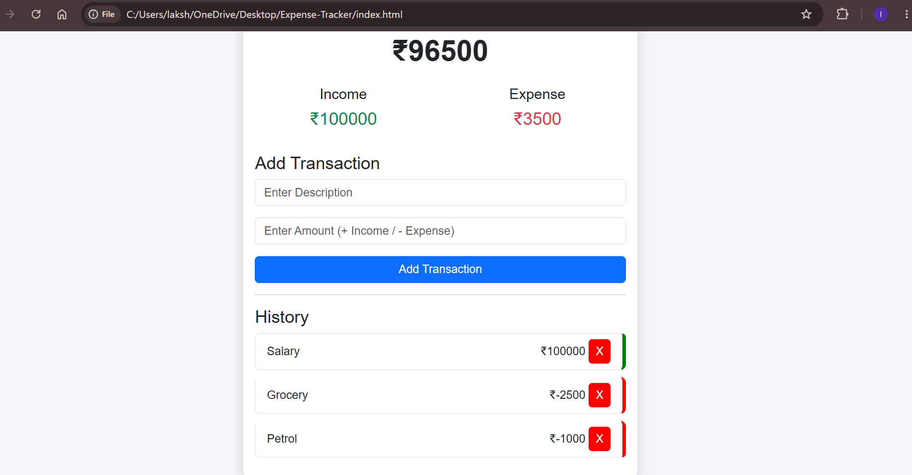

# 💰 Expense Tracker

A responsive Expense Tracker web application built using **HTML, CSS, Bootstrap, and JavaScript**. This application helps users track their income and expenses with automatic balance calculation. All transactions are saved using Local Storage, so the data remains even after refreshing the page.

---

## 🚀 Features

- ➕ Add Income
- ➖ Add Expense
- 💰 Current Balance
- 📊 Total Income
- 📉 Total Expense
- 🗑 Delete Transaction
- 💾 Local Storage Support
- 📱 Responsive Design

---

## 🛠 Technologies Used

- HTML5
- CSS3
- Bootstrap 5
- JavaScript (ES6)
- Local Storage

---

## 📸 Screenshot

---

## 📂 Folder Structure

Expense-Tracker/

├── index.html

├── style.css

├── script.js

├── README.md

└── expense-tracker.png

---

## 🎯 What I Learned

- DOM Manipulation
- Event Listeners
- Local Storage
- CRUD Operations
- JavaScript Arrays
- Responsive Design
- Bootstrap

---

## 👩‍💻 Author

Lakshmipriya S
# expense-tracker
A responsive Expense Tracker built using HTML, CSS, Bootstrap and JavaScript with Local Storage support.
